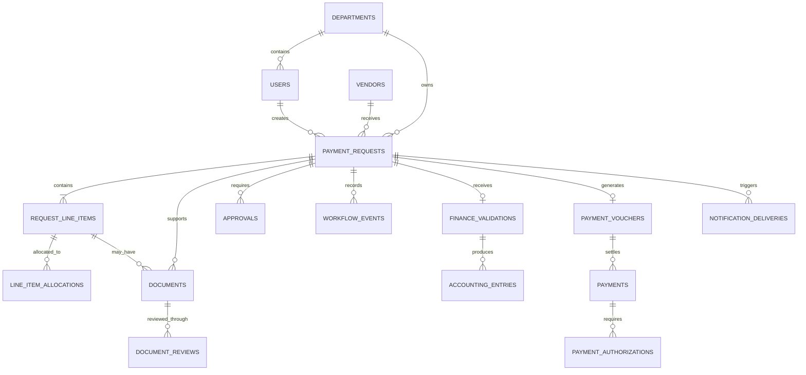

# Payment Module Database Design

## 1. Purpose

This document defines the proposed database architecture for the Automated Payment System. The design supports payment request creation, document validation, approval routing, accounting entries, voucher generation, payment processing, notifications, and complete audit history.

The recommended database is PostgreSQL. The schema is normalized around a central payment request while retaining separate records for request-type details, line items, documents, approvals, finance validation, vouchers, and actual payments.

## 2. Design principles

- Use UUID primary keys internally and separate human-readable business numbers such as `RMB-2026-0161`.
- Use `numeric(19,4)` for monetary amounts; never use floating-point types for money.
- Store an ISO 4217 currency code beside every independently meaningful amount.
- Keep workflow and approval history append-only.
- Do not hard-delete financial records. Void or archive them while retaining their history.
- Store uploaded files in object storage and retain only metadata and storage references in PostgreSQL.
- Separate a payment request, its voucher, and its settlement so partial, failed, retried, or replacement payments remain possible.
- Snapshot tax calculations and approval-policy versions used by a submitted request.
- Protect sensitive bank information with encryption, access control, and masking.

## 3. Philippine Time policy

All timestamps in the Payment Module must be recorded, processed, displayed, exported, and audited in Philippine Time using the IANA time-zone identifier `Asia/Manila` (UTC+08:00). The application must not rely on a browser or server's implicit local time zone.

PostgreSQL timestamp columns must use `timestamptz`. PostgreSQL represents a `timestamptz` value as an absolute instant, so the database and application must explicitly use `Asia/Manila` whenever a value is written, read, formatted, exported, or included in a notification.

Recommended database configuration:

```sql
ALTER DATABASE payment_module SET timezone TO 'Asia/Manila';
```

Every application connection should also set the session time zone:

```sql
SET TIME ZONE 'Asia/Manila';
```

Timestamp rules:

- API timestamps must include the Philippine offset, for example `2026-08-12T14:30:00+08:00`.
- Audit logs, approval decisions, document reviews, exports, emails, vouchers, and reports must show Philippine Time.
- Scheduled jobs must interpret business dates and deadlines in `Asia/Manila`.
- Date-only business fields, such as an event date or liquidation due date, should use `date`, not a timestamp.
- The schema should use defaults such as `CURRENT_TIMESTAMP`; the configured database session renders and accepts these values in Philippine Time.
- Tests must set `Asia/Manila` explicitly so results do not depend on the machine running them.

## 4. High-level relationship model



## 5. Core payment request

`payment_requests` contains fields shared by reimbursement, liquidation, cash advance, purchase-order payment, and general payment requests.

| Column | Suggested type | Notes |
|---|---|---|
| `id` | `uuid` | Primary key |
| `request_number` | `varchar(30)` | Unique business identifier |
| `request_type` | `varchar(30)` | Reimbursement, liquidation, cash advance, PO payment, or general |
| `requestor_id` | `uuid` | References `users` |
| `department_id` | `uuid` | Owning department |
| `vendor_id` | `uuid`, nullable | References `vendors` when applicable |
| `payee_name` | `varchar(255)` | Snapshot of the payee name |
| `purpose` | `text` | Business purpose |
| `currency_code` | `char(3)` | PHP, USD, EUR, or another ISO currency |
| `gross_amount` | `numeric(19,4)` | Requested total |
| `budget_status` | `varchar(30)` | Budgeted, unbudgeted, or over budget |
| `status` | `varchar(50)` | Current request state for efficient queries |
| `current_step` | `varchar(50)` | Current workflow step |
| `approval_policy_version_id` | `uuid` | Policy snapshot used for routing |
| `submitted_at` | `timestamptz`, nullable | Philippine Time policy applies |
| `completed_at` | `timestamptz`, nullable | Philippine Time policy applies |
| `created_at` | `timestamptz` | Defaults to `CURRENT_TIMESTAMP` |
| `updated_at` | `timestamptz` | Updated on mutation |
| `version` | `integer` | Optimistic-lock counter |

The UUID remains stable across integrations. The formatted `request_number` may follow different sequences per request type without becoming a foreign key.

## 6. Request-type extension tables

Fields unique to a request type should live in one-to-one extension tables rather than creating many nullable columns on `payment_requests`.

### `reimbursement_details`

- `request_id`
- `employee_id`
- `expense_period_from`
- `expense_period_to`
- `reimbursement_reason`

### `cash_advance_details`

- `request_id`
- `employee_id`
- `event_name`
- `event_start_date`
- `event_end_date`
- `liquidation_due_date`
- `return_bank_account_id`

The application calculates the current prototype's liquidation deadline as 15 days after the event end date. The calculated date should be persisted so later policy changes do not alter an existing request.

### `liquidation_details`

- `request_id`
- `cash_advance_request_id`
- `amount_advanced`
- `amount_spent`
- `amount_returned`
- `return_reference`

### `po_payment_details`

- `request_id`
- `purchase_order_id`
- `supplier_invoice_number`
- `supplier_is_new`

### `general_payment_details`

- `request_id`
- `billing_reference`
- `service_period_from`
- `service_period_to`

## 7. Line items and cost allocation

### `request_line_items`

| Column | Purpose |
|---|---|
| `id` | Primary key |
| `request_id` | Parent request |
| `line_number` | Stable display order within the request |
| `transaction_date` | Business date |
| `reference_number` | Receipt, invoice, or other reference |
| `particulars` | Description of the expense |
| `merchant_name` | Merchant or supplier on the line |
| `expense_account_id` | Proposed expense account |
| `quantity` | Optional quantity |
| `unit_price` | Optional unit price |
| `amount` | Line total as `numeric(19,4)` |
| `currency_code` | Currency for the line |
| `created_at` | Philippine Time timestamp |

### `line_item_allocations`

- `id`
- `line_item_id`
- `department_id`
- `cost_center_id`
- `amount`
- `percentage`, nullable

The sum of a request's line items must equal its gross amount. The allocation total for a line must equal that line's amount. These invariants should be checked in the same database transaction that submits or updates the request.

## 8. Documents and reviews

The file itself should be stored in private object storage. `documents` stores its metadata and immutable checksum.

### `documents`

- `id`
- `request_id`
- `line_item_id`, nullable
- `document_type`
- `original_filename`
- `storage_key`
- `mime_type`
- `size_bytes`
- `checksum`
- `is_required`
- `receipt_format`: hard copy, soft copy, or both
- `uploaded_by`
- `uploaded_at`
- `deleted_at`, nullable

### `document_reviews`

- `id`
- `document_id`
- `reviewer_id`
- `result`: pending, valid, needs correction, or rejected
- `note`
- `reviewed_at`

A new review row should be added for each decision instead of overwriting previous review information.

## 9. Workflow and approvals

The current status is stored on `payment_requests` for efficient lists and dashboards, but it is not the historical record. All transitions must also create an immutable workflow event.

### `approvals`

- `id`
- `request_id`
- `approval_stage`
- `approver_role`
- `approver_id`, nullable until assigned
- `sequence_number`
- `decision`: pending, approved, returned, rejected, or skipped
- `decision_note`
- `assigned_at`
- `decided_at`, nullable
- `delegated_from_id`, nullable

### `workflow_events`

- `id`
- `request_id`
- `event_type`
- `from_status`
- `to_status`
- `actor_id`, nullable for system events
- `actor_role`
- `reason`
- `metadata` as `jsonb`
- `occurred_at`

The initial routing rules reflected in the prototype are:

- A cash advance requires Finance Manager approval and is flagged when it exceeds PHP 40,000.
- A budgeted payment up to PHP 100,000 may be approved by the Finance Manager.
- A budgeted payment from PHP 100,000.01 through PHP 300,000 requires COO approval.
- A budgeted payment above PHP 300,000 requires President approval.
- An unbudgeted payment up to PHP 1,000,000 requires COO approval.
- An unbudgeted payment above PHP 1,000,000 requires Board Member approval after the applicable executive review.

The application may initially implement these rules in code. If Finance must administer them, introduce versioned `approval_policies` and `approval_policy_rules` tables. A submitted request must retain its policy version so a later threshold change does not silently reroute it.

## 10. Finance validation and accounting

### `finance_validations`

- `id`
- `request_id`
- `reviewer_id`
- `vat_classification`
- `ewt_code_id`, nullable
- `ewt_rate`
- `ewt_amount`
- `net_amount`
- `hard_copy_received`
- `soft_copy_received`
- `reviewer_note`
- `completed_at`

Tax values are calculation snapshots. Historical requests must not be recalculated automatically when tax rules change. The current prototype's automatic no-EWT treatment for requests at or below PHP 3,000 should be represented by a versioned tax rule rather than an unexplained hard-coded value in stored records.

### `accounting_entries`

- `id`
- `request_id`
- `finance_validation_id`
- `line_number`
- `account_id`
- `department_id`, nullable
- `cost_center_id`, nullable
- `debit_amount`
- `credit_amount`
- `currency_code`
- `description`

Finance validation cannot be completed unless total debits equal total credits within the currency's permitted precision.

## 11. Vouchers and payments

### `payment_vouchers`

- `id`
- `voucher_number`
- `request_id`
- `gross_amount`
- `tax_amount`
- `net_amount`
- `currency_code`
- `prepared_by`
- `prepared_at`
- `posted_at`, nullable
- `status`

### `payments`

- `id`
- `voucher_id`
- `payment_method`: bank transfer, check, or cash
- `amount`
- `currency_code`
- `bank_account_id`, nullable
- `check_number`, nullable
- `external_reference`, nullable
- `idempotency_key`
- `status`: prepared, authorized, available for pickup, released, cleared, failed, or voided
- `available_for_pickup_at`, nullable
- `released_at`, nullable
- `cleared_at`, nullable
- `created_at`

### `payment_authorizations`

- `id`
- `payment_id`
- `signatory_id`
- `authorization_order`
- `decision`
- `authorized_at`, nullable
- `note`

One voucher may have multiple payment attempts or settlements. This supports partial payments, failed transfers, void checks, and replacement payments without destroying history.

## 12. Master and supporting data

The complete schema will also require:

- `users`, `roles`, and `user_roles`
- `departments` and `cost_centers`
- `vendors` and encrypted `vendor_bank_accounts`
- `chart_of_accounts`
- `tax_codes` and versioned tax rules
- `purchase_orders` or references to an external PO system
- `company_bank_accounts`
- `approval_policies` and `approval_policy_rules` when policies become configurable
- `notification_deliveries`
- a system-wide `audit_log`

The system must never store online banking passwords, PINs, one-time passwords, or signing credentials.

## 13. Notifications and integration reliability

`notification_deliveries` should record each requested delivery independently from the workflow event that caused it.

Suggested fields include:

- `id`
- `request_id`
- `event_name`
- `template_key`
- `recipient_type`
- `recipient_address`
- `idempotency_key`
- `status`
- `attempt_count`
- `last_error`, nullable
- `queued_at`
- `sent_at`, nullable

Idempotency keys prevent duplicate payment instructions and duplicate emails when a background job retries.

## 14. Audit requirements

The audit log should capture security-sensitive and financially significant actions, including:

- request creation, submission, editing, unlocking, returning, and resubmission;
- document uploads, replacements, reviews, and removals;
- approval assignment, delegation, decision, and note changes;
- finance validation and accounting-entry completion;
- voucher creation, posting, and voiding;
- payment preparation, authorization, release, clearing, failure, and voiding;
- vendor, bank-account, role, permission, policy, and tax-rule changes;
- notification attempts and delivery outcomes.

Every audit record should contain the actor, action, entity type, entity ID, before-and-after values where appropriate, source IP or client context when available, correlation ID, and a Philippine Time `occurred_at` timestamp. Audit rows should be append-only and unavailable to ordinary update or delete operations.

## 15. Constraints and indexes

Recommended constraints include:

- unique `request_number` and `voucher_number`;
- nonnegative monetary values where negative entries are not explicitly allowed;
- valid three-character currency codes;
- one active request-type extension record per request;
- unique line numbers within a request;
- balanced accounting entries before validation completion;
- payment totals that cannot exceed the payable voucher balance unless an authorized exception exists;
- required approval completion before voucher creation;
- required authorization completion before payment release.

Recommended indexes include:

- `payment_requests(request_number)`;
- `payment_requests(status, submitted_at)`;
- `payment_requests(requestor_id, created_at)`;
- `payment_requests(department_id, status)`;
- `payment_requests(vendor_id, created_at)`;
- `approvals(approver_id, decision, assigned_at)`;
- `workflow_events(request_id, occurred_at)`;
- `documents(request_id, document_type)`;
- `payments(status, created_at)`;
- `notification_deliveries(status, queued_at)`.

## 16. Transaction boundaries

The following operations must be atomic database transactions:

- submitting a request and generating its approval route;
- making an approval decision and advancing or returning the workflow;
- completing finance validation and recording balanced entries;
- creating and posting a payment voucher;
- recording a payment instruction and its authorization requirements;
- releasing, clearing, failing, or voiding a payment;
- creating an audit event and the outbox event for a notification or integration.

An outbox table is recommended for backend integrations. Business changes and outbox events are committed together, after which a worker performs email, banking, ERP, or PO-system communication safely.

## 17. Security and access control

- Requestors may access their requests and permitted departmental records.
- Department Heads may review requests routed to their department.
- Finance Associates may validate documents and prepare vouchers or payments within their assigned duties.
- Finance Managers and executive approvers may act only on approvals assigned to their role or identity.
- Bank details must be masked by default and decrypted only for authorized payment processing.
- Payment preparation and payment authorization should be separated where organizational policy requires segregation of duties.
- Every privileged read or mutation of sensitive data should be auditable.

## 18. Suggested implementation phases

### Phase 1: Request and approval foundation

Implement users, departments, vendors, requests, request-type details, line items, allocations, documents, approvals, workflow events, and audit records.

### Phase 2: Finance processing

Add document reviews, tax codes, finance validation, chart of accounts, accounting entries, and voucher generation.

### Phase 3: Payment execution

Add payments, bank accounts, signatory authorizations, pickup and release tracking, notification delivery, and the transactional outbox.

### Phase 4: Integrations and policy administration

Add PO/ERP synchronization, bank integration, configurable approval policies, configurable tax rules, retention policies, and operational monitoring.

## 19. Open decisions before implementation

- Whether the first backend will be a custom API, Supabase, or another PostgreSQL-based platform.
- Whether vendor and PO data are mastered locally or synchronized from an ERP or procurement system.
- Whether multiple legal entities, branches, or company currencies are required.
- Whether foreign-currency requests are settled in the request currency or converted to PHP, and how exchange-rate snapshots are approved.
- Whether one request may generate multiple vouchers.
- Which roles may return, cancel, void, reopen, or urgently unlock a request.
- Required document-retention and audit-retention periods.
- Required segregation of duties for payment preparation and authorization.

These decisions refine the physical schema but do not change the central model described above.
